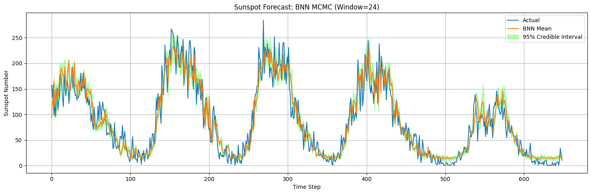
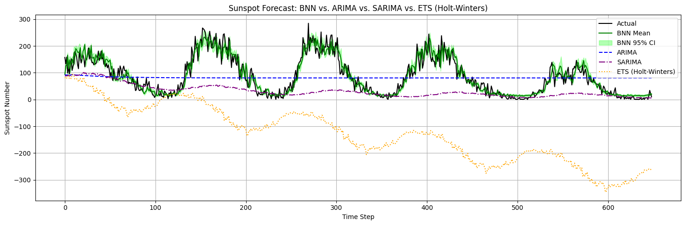

# Bayesian Neural Networks for Sunspot Forecasting

A comprehensive implementation of Bayesian Neural Networks (BNN) for time series forecasting, applied to historical sunspot data. This project demonstrates the superiority of probabilistic deep learning approaches over traditional statistical methods for complex cyclical time series prediction.

## 🌟 Overview

This project implements multiple Bayesian Neural Network architectures using both **Pyro (Variational Inference)** and **MCMC sampling** to forecast monthly sunspot numbers. The models capture uncertainty in predictions through Bayesian inference, providing credible intervals alongside point estimates.

### Key Features

- **Multiple BNN Architectures**: From simple shallow networks to deep multi-layer implementations
- **Two Inference Methods**: 
  - Stochastic Variational Inference (SVI) with Pyro
  - Markov Chain Monte Carlo (MCMC) with Metropolis-Hastings sampling
- **Uncertainty Quantification**: 95% credible intervals for all predictions
- **Comprehensive Comparison**: Benchmarked against ARIMA, SARIMA, and Exponential Smoothing (ETS)
- **Extensive EDA**: Time series decomposition, autocorrelation analysis, and statistical testing

## 📊 Results

The Bayesian Neural Network significantly outperforms traditional statistical methods:

| Model | RMSE | MAE |
|-------|------|-----|
| **Bayesian NN (MCMC)** | **24.65** | **18.56** |
| ARIMA | 69.22 | 57.97 |
| SARIMA | 83.85 | 59.46 |
| ETS (Holt-Winters) | 236.83 | 215.98 |

### Performance Visualization


*Bayesian Neural Network predictions with 95% credible intervals*


*Comparison of BNN against traditional time series methods*

## 🔬 Dataset

The project uses the **Monthly Mean Total Sunspot Number** dataset spanning from **1749 to present** (3,265+ observations). Sunspots follow an ~11-year solar cycle, making this an excellent test case for Bayesian forecasting methods.

**Data Source**: `data/Sunspots.csv`

## 🛠️ Implementation Details

### Model Architectures

1. **Shallow BNN** (Window=12)
   - Input → Hidden(32) → Output(1)
   - Trained with SVI using Pyro
   - Prior std: 0.1

2. **Deep BNN** (Window=48)
   - Input → Hidden(64) → Hidden(32) → Output(1)
   - Enhanced capacity for complex patterns
   - Prior std: 0.05

3. **MCMC BNN** (Window=24)
   - Custom implementation with Metropolis-Hastings
   - 10,000 samples with 50% burn-in
   - Langevin gradient option for efficient sampling

### Preprocessing Pipeline

- **Windowing**: Sliding window approach (12-48 months)
- **Normalization**: StandardScaler for inputs and outputs
- **Train-Test Split**: 80-20 split preserving temporal order
- **Missing Values**: Linear interpolation

### Key Techniques

- **Variational Inference**: Approximate posterior with parameterized distributions
- **MCMC Sampling**: Full Bayesian posterior via sampling
- **STL Decomposition**: Trend, seasonal, and residual components
- **Uncertainty Quantification**: Posterior predictive distributions

## 📁 Project Structure

```
bnn_forecasting/
├── bnn_notebook.ipynb      # Main analysis notebook
├── data/
│   └── Sunspots.csv        # Historical sunspot data
├── images/                 # Output visualizations
│   ├── output1.png         # EDA visualizations
│   ├── output2.png         # Decomposition plots
│   ├── output3.png         # Deep BNN results
│   ├── output4.png         # MCMC BNN forecast
│   └── output5.png         # Model comparison
├── requirements.txt        # Python dependencies
├── README.md               # Project documentation
└── LICENSE                 # License file
```

## 🚀 Getting Started

### Prerequisites

- Python >= 3.8
- See `requirements.txt` for full list of dependencies

### Installation

```bash
# Clone the repository
git clone https://github.com/yourusername/bnn_forecasting.git
cd bnn_forecasting

# Create a virtual environment (recommended)
python -m venv venv
source venv/bin/activate  # On Windows: venv\Scripts\activate

# Install dependencies
pip install -r requirements.txt
```

### Usage

Open and run the Jupyter notebook:

```bash
jupyter notebook bnn_notebook.ipynb
```

The notebook is organized into sections:
1. **Data Preprocessing** - Loading and cleaning
2. **Exploratory Data Analysis** - Visualization and decomposition
3. **BNN with Pyro** - Variational inference implementation
4. **BNN with MCMC** - Custom MCMC sampler
5. **Baseline Models** - ARIMA, SARIMA, ETS
6. **Results & Comparison** - Performance metrics and plots

## 🔍 Exploratory Data Analysis

The notebook includes comprehensive EDA:

- **Time Series Visualization**: Full historical sunspot data (1749-present)
- **STL Decomposition**: Separating trend, seasonal (11-year cycle), and residual components
- **Statistical Analysis**: 
  - Rolling mean and variance
  - Autocorrelation Function (ACF)
  - Partial Autocorrelation Function (PACF)
  - Distribution analysis
- **Cycle Analysis**: Focused view of 1950-1970 cycles

## 🎯 Model Selection

### Why Bayesian Neural Networks?

1. **Uncertainty Quantification**: Provides prediction intervals, not just point estimates
2. **Handles Non-linearity**: Captures complex patterns in solar cycle data
3. **Robust to Overfitting**: Bayesian priors regularize the model
4. **Flexible Architecture**: Can adapt to different window sizes and depths

### Hyperparameter Tuning

- **Window Sizes Tested**: 12, 24, 36, 48 months
- **Hidden Layers**: 10-64 neurons
- **Learning Rates**: 0.001-0.01
- **Prior Distributions**: Normal(0, 0.05-0.1)
- **MCMC Steps**: 10,000 with 50% burn-in

## 📈 Key Findings

1. **BNN superiority**: ~65% RMSE improvement over ARIMA
2. **Uncertainty captures complexity**: Credible intervals widen during cycle transitions
3. **Window size matters**: 24-month window optimal for 11-year cycle
4. **Deep architectures help**: 2-layer networks slightly outperform shallow ones
5. **MCMC vs SVI**: Similar performance, MCMC provides better uncertainty estimates


## 📚 References

- Pyro: Deep Universal Probabilistic Programming ([paper](http://jmlr.org/papers/v20/18-403.html))
- Bayesian Deep Learning: [Yarin Gal's thesis](http://mlg.eng.cam.ac.uk/yarin/thesis/thesis.pdf)
- Solar cycle prediction: [NOAA Space Weather Prediction Center](https://www.swpc.noaa.gov/)

## 📄 License

This project is licensed under the MIT License - see the [LICENSE](LICENSE) file for details.

## 🤝 Contributing

Contributions are welcome! Please feel free to submit a Pull Request. For major changes, please open an issue first to discuss what you would like to change.

## 👤 Author


- GitHub: [@Jevgenijsposashkov](https://github.com/Jevgenijsposashkov)


## 🙏 Acknowledgments

- Sunspot data from [SILSO World Data Center](http://www.sidc.be/silso/)
- Bayesian deep learning community
- Pyro development team

## ⭐ Show your support

Give a ⭐️ if this project helped you understand Bayesian deep learning for time series forecasting!

---

**Note**: This is a research/educational project demonstrating Bayesian deep learning techniques. For production solar forecasting, consult professional space weather services.
